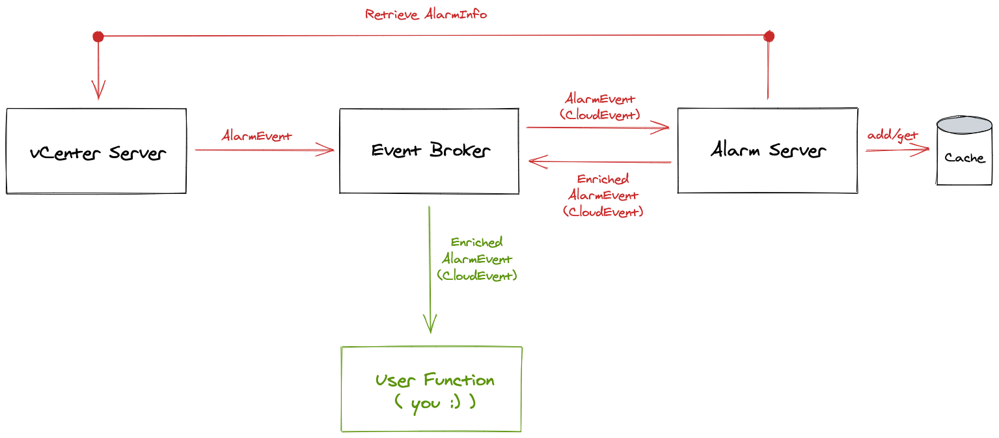

# About

[](https://github.com/embano1/vsphere-alarm-server/actions/workflows/release.yaml)
[](https://github.com/embano1/vsphere-alarm-server/actions/workflows/unit-test.yaml)
[](https://goreportcard.com/report/github.com/embano1/vsphere-alarm-server)
[](https://codecov.io/gh/embano1/vsphere-alarm-server)
[](https://github.com/embano1/vsphere-alarm-server)

Reacting to vSphere
[Alarms](https://docs.vmware.com/en/VMware-vSphere/6.7/com.vmware.vsphere.monitoring.doc/GUID-79AC1262-D701-4BC8-8F8D-F046AE0578CF.html)
via
[events](https://vdc-download.vmware.com/vmwb-repository/dcr-public/8946c1b6-2861-4c12-a45f-f14ae0d3b1b9/a5b8094c-c222-4307-9399-3b606a04af55/vim.event.AlarmEvent.html)
is a common requirement in building a resilient and scalable VMware vSphere
infrastructure. **Event-driven systems** are seeing increased adoption these
days due to their inherent nature of decoupling (sender/receiver), scalability
("fan out") and lower latency compared to polling over synchronous (blocking)
connections.

For example, an alarm can be created when a virtual machine is powered off or a
datastore is close to exceeding its capacity. However, when it comes to defining
actions executed when an alarm is triggered, VMware vCenter itself is rather
**limited** in its capabilities, only providing options for sending an
email/SNMP message or executing a script directly on the vCenter appliance. The
latter being a suboptimal solution due to security, scalability, resource and
extensibility concerns.

A more flexible solution is using an eventing system, like the VMware Event
Broker Appliance ([VEBA](https://vmweventbroker.io/)) or Knative
[Eventing](https://knative.dev/docs/eventing/). One can react to vSphere events
via user-provided functions (Function-as-a-Service) or forward events to a
persistence layer, e.g. database, Kafka messaging system, etc. for long-term
data retention, data transformation and analytics. Another benefit is that these
platforms use a **standard message** format
([CloudEvents](https://cloudevents.io/)) to simplify the creation/consumption of
events across platforms.

However, vSphere Alarm events pose a challenge for the end user: Alarm events do
not provide details on the underlying alarm definition, requiring the user
(function author) to write complex logic to retrieve additional metadata on the
alarm which triggered the event.

In addition, this leads to **increased load on vCenter** due to constantly
having to query for additional (alarm) information or writing custom caching
logic.

This project aims to tackle such common requirements by:

- Enriching vSphere Alarm events
  ([vim.event.Alarm*](https://vdc-download.vmware.com/vmwb-repository/dcr-public/8946c1b6-2861-4c12-a45f-f14ae0d3b1b9/a5b8094c-c222-4307-9399-3b606a04af55/vim.event.AlarmEvent.html))
  with metadata about the underlying alarm definition, e.g. defined thresholds
  and triggers
- Caching (with TTL expiration) alarm metadata to reduce load on vCenter and
  increase throughput
- Using CloudEvents as a standardized messaging format for ease of integration
  and extensibility

## Event Flow




## Example

### Regular AlarmStatusChangedEvent

The CloudEvent payload of a vSphere `AlarmStatusChangedEvent` provides useful
information about the alarm and associated vSphere objects:

```json
{
  "Key": 51141,
  "ChainId": 51141,
  "CreatedTime": "2021-03-26T09:05:17.663Z",
  "UserName": "",
  "Datacenter": {
    "Name": "vcqaDC",
    "Datacenter": {
      "Type": "Datacenter",
      "Value": "datacenter-2"
    }
  },
  "ComputeResource": {
    "Name": "cls",
    "ComputeResource": {
      "Type": "ClusterComputeResource",
      "Value": "domain-c7"
    }
  },
  "Host": {
    "Name": "10.161.139.167",
    "Host": {
      "Type": "HostSystem",
      "Value": "host-27"
    }
  },
  "FullFormattedMessage": "Alarm 'test-04' on 10.161.139.167 changed from Green to Yellow",
  "ChangeTag": "",
  "Alarm": {
    "Name": "test-04",
    "Alarm": {
      "Type": "Alarm",
      "Value": "alarm-285"
    }
  },
  "Source": {
    "Name": "10.161.139.167",
    "Entity": {
      "Type": "HostSystem",
      "Value": "host-27"
    }
  },
  "Entity": {
    "Name": "10.161.139.167",
    "Entity": {
      "Type": "HostSystem",
      "Value": "host-27"
    }
  },
  "From": "green",
  "To": "yellow"
}
```

> **Note:** Available vSphere Alarm event schemas and classes are described
> [here](https://vdc-download.vmware.com/vmwb-repository/dcr-public/8946c1b6-2861-4c12-a45f-f14ae0d3b1b9/a5b8094c-c222-4307-9399-3b606a04af55/vim.event.AlarmEvent.html).

### Enriched AlarmStatusChangedEvent

Using the vSphere Alarm Server, any vSphere Alarm event it receives
(configurable via `Trigger`, see below) will be enriched with the underlying
`AlarmInfo`, i.e. alarm definition. Note the injected `AlarmInfo` JSON object:

```json
{
  "Alarm": {
    "Alarm": {
      "Type": "Alarm",
      "Value": "alarm-285"
    },
    "Name": "test-04"
  },
  "AlarmInfo": {
    "Name": "test-04",
    "SystemName": "",
    "Description": "",
    "Enabled": true,
    "Expression": {
      "Expression": [
        {
          "Operator": "isAbove",
          "Type": "HostSystem",
          "Metric": {
            "CounterId": 125,
            "Instance": ""
          },
          "Yellow": 10,
          "YellowInterval": 30,
          "Red": 0,
          "RedInterval": 0
        }
      ]
    },
    "Action": null,
    "ActionFrequency": 0,
    "Setting": {
      "ToleranceRange": 0,
      "ReportingFrequency": 300
    },
    "Key": "",
    "Alarm": {
      "Type": "Alarm",
      "Value": "alarm-285"
    },
    "Entity": {
      "Type": "HostSystem",
      "Value": "host-27"
    },
    "LastModifiedTime": "2021-03-23T09:38:42.03237Z",
    "LastModifiedUser": "VSPHERE.LOCAL\\Administrator",
    "CreationEventId": 0
  },
  "ChainId": 51141,
  "ChangeTag": "",
  "ComputeResource": {
    "ComputeResource": {
      "Type": "ClusterComputeResource",
      "Value": "domain-c7"
    },
    "Name": "cls"
  },
  "CreatedTime": "2021-03-26T09:05:17.663Z",
  "Datacenter": {
    "Datacenter": {
      "Type": "Datacenter",
      "Value": "datacenter-2"
    },
    "Name": "vcqaDC"
  },
  "Entity": {
    "Entity": {
      "Type": "HostSystem",
      "Value": "host-27"
    },
    "Name": "10.161.139.167"
  },
  "From": "green",
  "FullFormattedMessage": "Alarm 'test-04' on 10.161.139.167 changed from Green to Yellow",
  "Host": {
    "Host": {
      "Type": "HostSystem",
      "Value": "host-27"
    },
    "Name": "10.161.139.167"
  },
  "Key": 51141,
  "Source": {
    "Entity": {
      "Type": "HostSystem",
      "Value": "host-27"
    },
    "Name": "10.161.139.167"
  },
  "To": "yellow",
  "UserName": "",
}
```

> **Note:** The vSphere Alarm Server enriches the original event by patching the
> original event payload (AlarmEvent) and append a
> [configurable](#environment-variables) suffix to the CloudEvent `type`
> atttribute. Consumers, e.g. functions, can subscribe or filter for this
> specific event `type` to ignore the original (unmodified) events and avoid
> multiple invocations on the same alarm event.

# Installation

## Requirements

- VMware Event Broker Appliance with the
  [Knative](https://vmweventbroker.io/kb/install-knative) event processor
  connected to a vCenter
- `kubectl`

> **Note:** Alternatively, the deployment could be made directly on Knative
> Eventing using the [VMware Tanzu Sources for
> Knative](https://github.com/vmware-tanzu/sources-for-knative). However,
> currently the sources only emit XML encoded vSphere events which this project
> does not support. An
> [issue](https://github.com/vmware-tanzu/sources-for-knative/issues/222) is
> open to track this limitation.

## Deploy from Release

Create a secret holding your vCenter credentials using `kubectl` targeting your
VEBA deployment:

> **Note:** The examples use the `vmare-system` namespace because it has the
> required `default` broker already set up.

```
kubectl -n vmware-functions create secret generic vsphere-credentials --from-literal=username=administrator@vsphere.local --from-literal=password=passw0rd
```

> **Note:** The credentials are used by the vSphere Alarm Server to retrieve
> alarm definitions. Thus, a read-only role is sufficient. If you scope the role
> to a particular cluster/inventory objects, the server might not be able to
> retrieve all alarm definitions for the incoming events.


Next, download
[this](https://github.com/embano1/vsphere-alarm-server/releases/download/v0.1.0/release.yaml)
release manifest for the Kubernetes objects, e.g. via `curl`:

```
export RELEASE=v0.1.1 
curl -L -O https://github.com/embano1/vsphere-alarm-server/releases/download/${RELEASE}/release.yaml
```

The manifest contains the following objects:

- Deployment for the vSphere Alarm Server
- Secret for the vSphere Alarm Server to retrieve vSphere Alarm definitions
- Trigger to customize which events to send to the vSphere Alarm Server

### Configure the vSphere Alarm Server

Change the environment variables in the `deployment` according to your setup
(see [documentation](#environment-variables) below). 

### Configure the Secret

If you followed the `kubectl create secret` command above, no change is needed.
Otherwise change the name in the YAML manifest to match your setup.

### Configure the Trigger

The broker in VEBA in the `vmware-functions` namespace is called `default`, thus no change is required in the provided `Trigger` YAML manifest. Otherwise change this line accordingly:

```yaml
spec:
  broker: default
```

### Deploy the application components:

```
kubectl -n vmware-functions apply -f release.yaml
```

Verify all components are up and running:


```yaml
kubectl -n vmware-functions get all -l app=vsphere-alarm-server
NAME                                        READY   STATUS    RESTARTS   AGE
pod/vsphere-alarm-server-7cf9756785-mj9sf   1/1     Running   0          1m

NAME                           TYPE        CLUSTER-IP     EXTERNAL-IP   PORT(S)   AGE
service/vsphere-alarm-server   ClusterIP   10.96.44.213   <none>        80/TCP    1m

NAME                                   READY   UP-TO-DATE   AVAILABLE   AGE
deployment.apps/vsphere-alarm-server   1/1     1            1           1m

NAME                                              DESIRED   CURRENT   READY   AGE
replicaset.apps/vsphere-alarm-server-7cf9756785   1         1         1       1m

NAME                                                BROKER    SUBSCRIBER_URI                                                    AGE  READY   REASON
trigger.eventing.knative.dev/vsphere-alarm-server   default   http://vsphere-alarm-server.vmware-functions.svc.cluster.local/   1m   True
```

#### Troubleshooting: vSphere Alarm Server is in CrashLoop backoff

Check the logs of the deployment for errors:

```
kubectl -n vmware-functions logs deploy/vsphere-alarm-server
```

#### Troubleshooting: Trigger is not showing "Ready"

Check the trigger definition for issues:


```
kubectl -n vmware-functions describe trigger vsphere-alarm-server
```

## Environment Variables

The vSphere Alarm Server is configured through environment variables (in the
Kubernetes `deployment` manifest) instead of using command line flags.

| Variable         | Description                                                                                                   | Default                 | Required |
|------------------|---------------------------------------------------------------------------------------------------------------|-------------------------|----------|
| PORT             | Listen port for the server                                                                                    | 8080                    | yes      |
| CACHE_TTL        | Time-to-live for alarm objects in the cache before requesting update from vCenter                             | 3600 (seconds)          | no       |
| VCENTER_URL      | URI of vCenter to connect to (https://vcenter.corp.local)                                                     | (empty)                 | yes      |
| VCENTER_INSECURE | Ignore TLS certificate warnings when connecting to vCenter                                                    | "false"                 | no       |
| SECRET_PATH      | Where to mount the injected vSphere Kubernetes secret credentials                                             | "/var/bindings/vsphere" | yes      |
| DEBUG            | Print debug log statements                                                                                    | "false"                 | no       |
| EVENT_SUFFIX     | Suffix to append to the CloudEvents `type`, e.g. "AlarmInfo"                                                  | (empty)                 | yes      |
| ALARM_KEY        | Injected JSON key into the CloudEvents `data` (payload) representing the alarm info details, e.g. "AlarmInfo" | (empty)                 | yes      |

### Example EVENT_SUFFIX

If the incoming CloudEvent `type` is `com.vmware.event.router/event` and the
event `data` is a class of AlarmEvent the returned event type using
`EVENT_SUFFIX="AlarmInfo"` would be `com.vmware.event.router/event.AlarmInfo`.